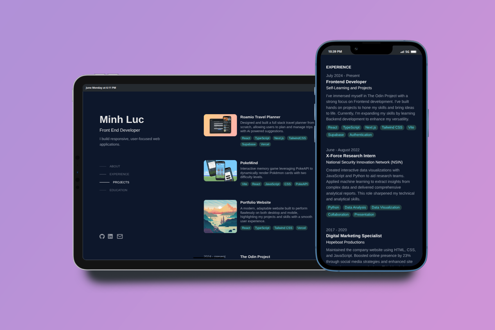

# Personal Portfolio - Minh Luc

A modern, responsive portfolio website built with React, Next.js and Tailwind CSS.

  

[<u><font size="3">Live Link</font></u>](https://www.minhluc.com)

## Features

- Modern and clean design
- Fully responsive layout (mobile and desktop)
- Smooth scrolling navigation

## Tech Stack

- **Library & Framework:** React, Next.js
- **Language:** TypeScript
- **Styling:** Tailwind CSS
- **Deployment:** Vercel

## Getting Started

1. Clone the repository:

```bash
git clone https://github.com/mluc404/portfolio.git
```

2. Install dependencies:

```bash
npm install
```

3. Run the development server:

```bash
npm run dev
```

4. Open [http://localhost:3000](http://localhost:3000) in your browser.

## Customization

1. Update personal information in `app/constant/myInfo.ts`
2. Modify styles in `app/globals.css`
3. Replace images in `public/` directory

## Acknowledgement

Credit to [Brittany Chiang](https://github.com/bchiang7) for design inspiration

## Contact

- GitHub: [@mluc404](https://github.com/mluc404)
- LinkedIn: [minhluc](https://www.linkedin.com/in/minhluc)
- Email: mluc.connect@gmail.com
